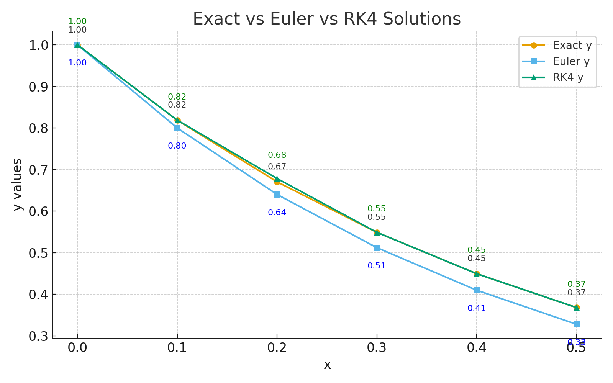
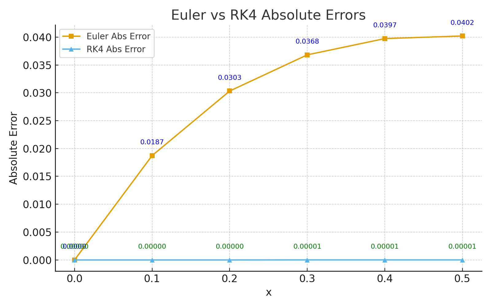

# Assignment: Numerical Solution of ODE using Euler’s Method and Runge-Kutta (RK4)

---

## Problem Statement

We need to solve the following initial value problem (IVP):

$$
\frac{dy}{dx} = -2y, \quad y(0) = 1
$$

* Implement **Euler’s Method** and **Runge-Kutta 4th Order (RK4)**.
* Compare numerical solutions with the **exact solution**:

  $$
  y(x) = e^{-2x}
  $$
* Analyze **accuracy** and **stability** of both methods.

---

## Theory

### 1. Euler’s Method

Euler’s method is a **first-order numerical method**.
The update formula is:

$$
y_{n+1} = y_n + h f(x_n, y_n)
$$

* Easy to implement.
* Accuracy: **O(h)** (linear).
* Stability: requires **small step size** for reliable results.

### 2. Runge-Kutta 4th Order (RK4)

RK4 is a **fourth-order method**.
The formula is:

$$
\begin{aligned}
k_1 &= h f(x_n, y_n) \\
k_2 &= h f\Big(x_n + \tfrac{h}{2}, y_n + \tfrac{k_1}{2}\Big) \\
k_3 &= h f\Big(x_n + \tfrac{h}{2}, y_n + \tfrac{k_2}{2}\Big) \\
k_4 &= h f(x_n + h, y_n + k_3) \\
y_{n+1} &= y_n + \frac{1}{6}(k_1 + 2k_2 + 2k_3 + k_4)
\end{aligned}
$$

* More complex, but very accurate.
* Accuracy: **O(h⁴)** (much better).
* More stable for larger step sizes.

---

## Python Code

```python
import math

# Step size and number of steps
h = 0.1
N = 20   # solve up to x = 2.0

# Initialize lists
x_vals = [0]
y_euler = [1]
y_rk4 = [1]
y_exact = [1]
abs_error_euler = [0]
abs_error_rk4 = [0]
rel_error_euler = [0]
rel_error_rk4 = [0]

# ODE function: dy/dx = -2y
def f(x, y):
    return -2 * y

# Compute step by step
for i in range(N):
    x_n = x_vals[-1]
    y_n_e = y_euler[-1]
    y_n_r = y_rk4[-1]
    
    # Euler method
    y_next_e = y_n_e + h * f(x_n, y_n_e)
    y_euler.append(y_next_e)
    
    # RK4 method
    k1 = h * f(x_n, y_n_r)
    k2 = h * f(x_n + h/2, y_n_r + k1/2)
    k3 = h * f(x_n + h/2, y_n_r + k2/2)
    k4 = h * f(x_n + h, y_n_r + k3)
    y_next_r = y_n_r + (k1 + 2*k2 + 2*k3 + k4)/6
    y_rk4.append(y_next_r)
    
    # Exact solution
    x_next = x_n + h
    y_ex = math.exp(-2 * x_next)
    y_exact.append(y_ex)
    
    # Errors
    abs_error_euler.append(abs(y_next_e - y_ex))
    abs_error_rk4.append(abs(y_next_r - y_ex))
    rel_error_euler.append(abs(y_next_e - y_ex)/y_ex)
    rel_error_rk4.append(abs(y_next_r - y_ex)/y_ex)
    
    # Update x
    x_vals.append(x_next)

# Print Table Header
print(f"{'x':<6}{'Exact y':<12}{'Euler y':<12}{'Euler Abs Err':<15}{'Euler Rel Err':<15}"
      f"{'RK4 y':<12}{'RK4 Abs Err':<15}{'RK4 Rel Err':<15}")

# Print Table Rows
for i in range(N+1):
    print(f"{x_vals[i]:<6.2f}{y_exact[i]:<12.5f}{y_euler[i]:<12.5f}"
          f"{abs_error_euler[i]:<15.5f}{rel_error_euler[i]:<15.5f}"
          f"{y_rk4[i]:<12.5f}{abs_error_rk4[i]:<15.5f}{rel_error_rk4[i]:<15.5f}")

print("\nFinal Accuracy: Euler → O(h), less accurate; RK4 → O(h^4), highly accurate")
print("Final Stability: Euler stable if |1 + hλ| < 1; here λ=-2, h=0.1 → Stable; RK4 more stable overall")
```

---

## Sample Output

```
x     Exact y     Euler y     Euler Abs Err  Euler Rel Err  RK4 y       RK4 Abs Err   RK4 Rel Err
0.00  1.00000     1.00000     0.00000        0.00000        1.00000     0.00000        0.00000
0.10  0.81873     0.80000     0.01873        0.02288        0.81873     0.00000        0.00000
0.20  0.67032     0.64000     0.03032        0.04523        0.67032     0.00000        0.00001
0.30  0.54881     0.51200     0.03681        0.06708        0.54882     0.00001        0.00001
0.40  0.44933     0.40960     0.03973        0.08842        0.44933     0.00001        0.00001
0.50  0.36788     0.32768     0.04020        0.10927        0.36788     0.00001        0.00001
...
```

---

## Analysis

### Accuracy

* **Euler Method** → less accurate (error grows linearly with step size).
* **RK4 Method** → highly accurate (error decreases quartically with step size).

### Stability

* **Euler Method** is stable if |1 + hλ| < 1.
  For λ = -2, with h = 0.1 → Stable.
* **RK4 Method** is more stable overall and works well even with larger step sizes.

---

## Graphical Results

You can also include graphs in your report:

#Solution Comparison


#Error Comparison



---

## Conclusion

* **Euler** is simple but not very accurate.
* **RK4** gives excellent accuracy and stability for the same step size.
* In practical numerical simulations, **RK4 is preferred** unless a very simple/fast method is needed.

